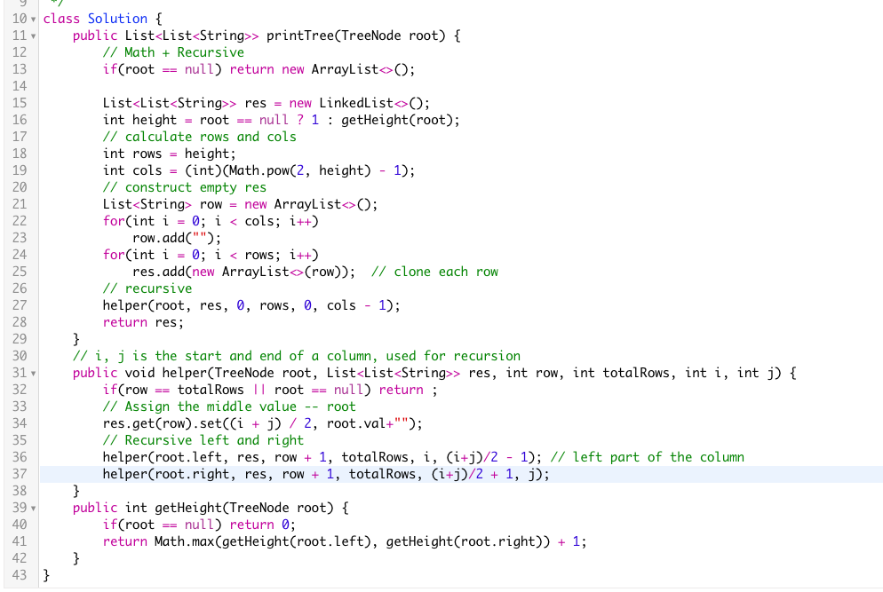
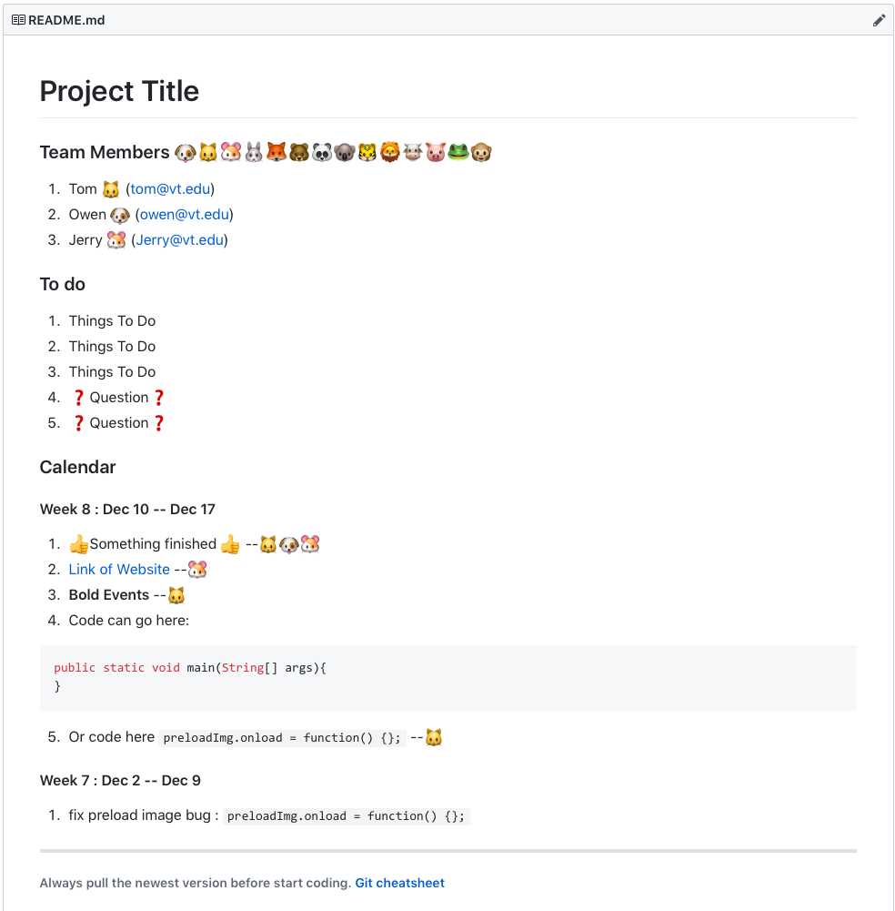
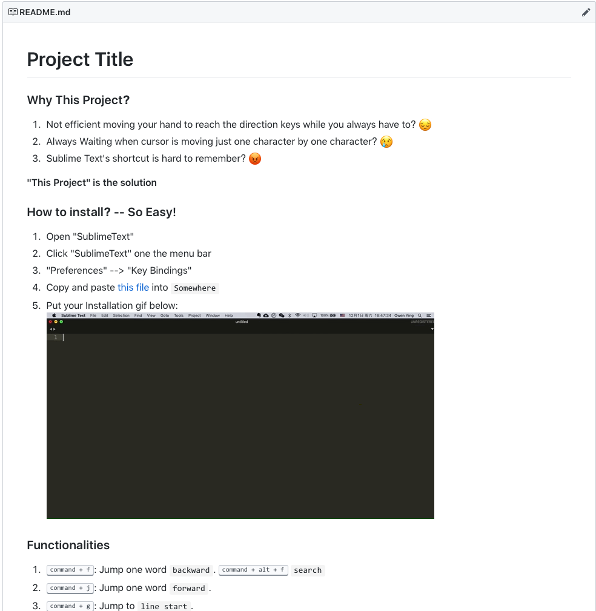
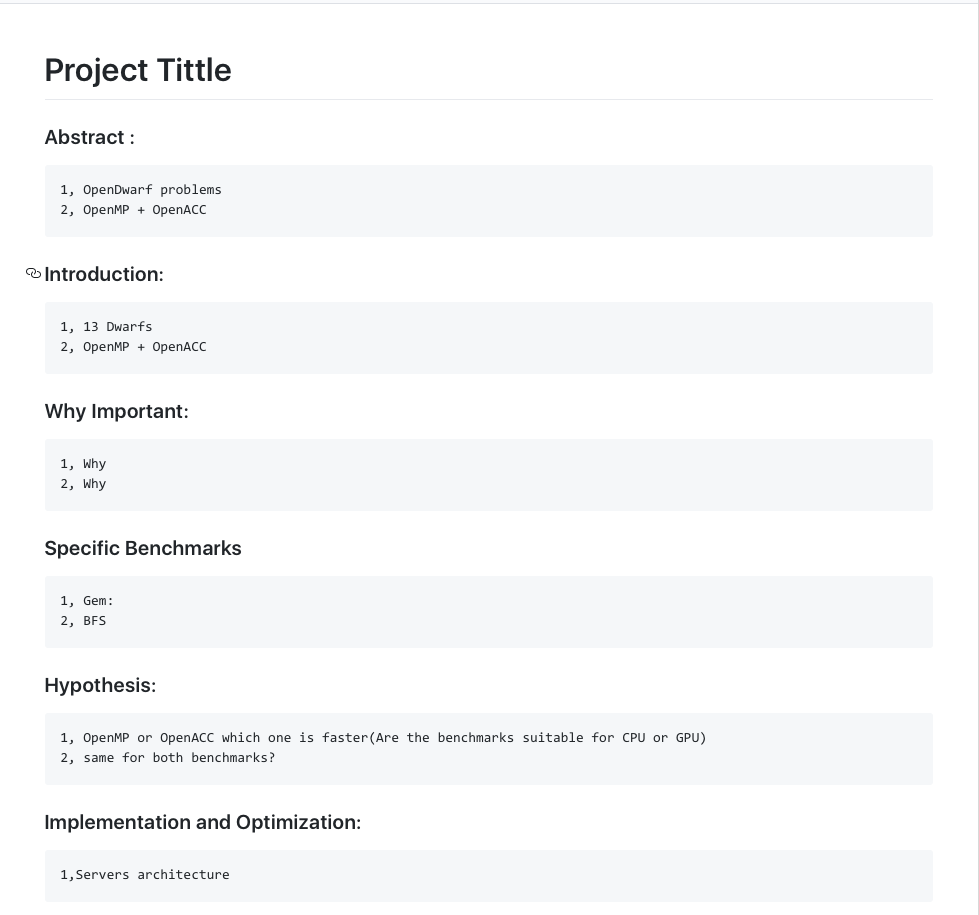
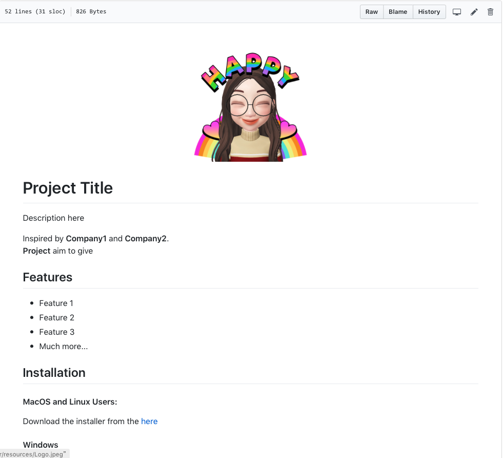

# README Templates

## Why README Templates?
1. Want really clean and beautiful README.md on Github.
2. Tired of writing README.md from scratch everytime when starting a new repo.
3. Tired of looking up [Markdown Cheatsheet](https://github.com/adam-p/markdown-here/wiki/Markdown-Cheatsheet) everytime. 

## How to use README Templages?
1. Browse the categories & choose one.
2. Click on ```edit``` icon on the top right corner of README.md.
3. Copy & Paste to your own Repository's README.md file.
4. Change the Content to whatever you like.

## How to contribute?
1. Through Github.
2. Email your README.md file to the author: ```ytc@vt.edu``` with your name, <br/>
   <b>We will mark you as the template's contributor!</b>

## Currently What We Have(Click on the image to source code):
<div align="left">
   <a href="https://github.com/OwenYing/README-Templates/blob/master/Book/README.md">
    
</div> 
<div align="right">
   <a href="https://github.com/OwenYing/README-Templates/blob/master/Calendar/README.md">
    
</div>
<div align="left">
   <a href="https://github.com/OwenYing/README-Templates/blob/master/Personal%20Projects/README.md">
    
</div> 
<div align="right">
   <a href="https://github.com/OwenYing/README-Templates/blob/master/Personal%20Projects/Schoole_Project.md">
    
</div>
<div align="left">
   <a href="https://github.com/OwenYing/README-Templates/blob/master/Formal%20Project/README.md">
    
</div> 
 
